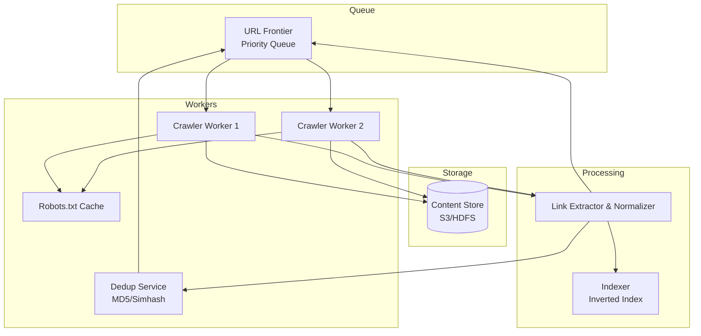

# 28-web-crawler - Web Crawler
Generated: 2025-11-02 20:38:45 -05:00

---

<!-- Source: 01-requirements.md -->
# Requirements & Scale

## Functional Requirements
1. **URL Discovery**: Start with seed URLs, extract links from crawled pages, prioritize frontier
2. **Fetch & Parse**: Download HTML, extract text/links, detect content type (HTML/PDF/image)
3. **Robots.txt Compliance**: Respect /robots.txt (disallowed paths, crawl-delay directive)
4. **Politeness**: Limit requests per domain (default 1 req/sec, configurable per robots.txt)
5. **Deduplication**: Detect duplicate content (exact, near-duplicate) via content hashing
6. **Recrawl Scheduling**: Prioritize frequently-changing pages (news: daily, blogs: weekly, static: monthly)
7. **Distributed Crawling**: Partition URLs across workers by domain (avoid parallel requests to same domain)

## Non-Functional Requirements
**Throughput**: 1M pages/sec globally (100K domains × 10 req/sec avg)
**Storage**: 10B pages × 100KB avg = 1PB raw HTML + metadata
**Latency**: Process each page within 10s (fetch + parse + store)
**Availability**: 99.9% uptime (crawlers can tolerate downtime, batch system)

## Scale Estimates
**Pages**: 10B pages, 30-day recrawl → 10B / 30 / 86400 = 3.8K pages/sec sustained, 1M pages/sec peak
**Domains**: 100K domains, politeness 1 req/sec → max 100K req/sec (1 per domain)
**HTML Size**: 100KB avg page → 10B pages = 1PB storage
**Links**: 50 outbound links/page avg → 500B links total (graph structure)

**Infrastructure**:
- Crawlers: 1000 worker nodes (1K pages/sec each)
- URL Frontier: Distributed queue (Kafka/RabbitMQ) with 1B URLs queued
- Deduplication DB: Bloom filter + content hash (MD5/SHA256) for 10B pages
- Storage: S3/HDFS for raw HTML (1PB)

**Cost**: $500K/mo (compute) + $50K (storage) + $100K (network bandwidth) = **$650K/mo**


---

<!-- Source: 02-architecture.md -->
# 2) High-Level Architecture (Most Detailed)



## Components

### 1. URL Frontier (Priority Queue)
Distributed queue storing URLs to crawl, prioritized by:
- **Freshness**: Recrawl news sites daily, static pages monthly
- **PageRank**: Prioritize high-authority domains
- **Domain Politeness**: Ensure 1 req/sec per domain (rate limiting)

### 2. Crawler Workers
Distributed workers that:
1. Pop URL from frontier
2. Check robots.txt cache (respect disallowed paths)
3. Fetch page (HTTP GET with User-Agent header)
4. Extract links, text, metadata
5. Push new URLs to frontier
6. Store page content to S3

### 3. Robots.txt Cache
In-memory cache (Redis) storing robots.txt rules per domain:
```
domain: example.com
disallowed: [/admin, /private]
crawl_delay: 2s
```
TTL: 24 hours (refresh daily).

### 4. Deduplication Service
**Exact Duplicates**: MD5 hash of page content → if hash exists, skip
**Near-Duplicates**: Simhash (locality-sensitive hashing) → detect 90% similar pages

### 5. Content Store
S3/HDFS storing raw HTML + metadata:
```
{url, domain, fetch_time, status_code, html_content, outbound_links[]}
```

### 6. Link Extractor & Normalizer
Parse HTML → extract `<a href>` tags → normalize URLs:
- Relative → absolute (href="/about" → "https://example.com/about")
- Remove fragments (#section)
- Canonicalize (www.example.com → example.com)

### 7. Scheduler
Background job that:
- Computes next crawl time (news: now + 1d, blogs: now + 7d)
- Enqueues URLs to frontier with priority

## Data Flows

### Flow A: Crawl New Page
1. **Worker** pops URL from frontier: `https://example.com/page1`
2. **Worker** checks robots.txt cache: `/page1` allowed ✓
3. **Worker** fetches page (HTTP GET, respects crawl-delay 1s)
4. **Worker** parses HTML: Extracts 50 outbound links + page text
5. **Deduplication Service**: Hash content (MD5) → not seen before ✓
6. **Content Store**: Save HTML to S3: `s3://crawled-pages/example.com/page1.html`
7. **Worker** normalizes links → pushes to frontier (50 new URLs)
8. **Worker** waits 1s (politeness) before next request to example.com

### Flow B: Detect Duplicate Content
1. Worker crawls `example.com/page2` → content hash: `abc123`
2. Deduplication Service: Lookup hash in Bloom filter → exists ✓
3. Worker skips storage (duplicate), logs duplicate for analytics

### Flow C: Robots.txt Handling
1. Worker encounters new domain: `newsite.com/page1`
2. Worker fetches `newsite.com/robots.txt`:
```
User-agent: *
Disallow: /private
Crawl-delay: 2
```
3. Cache robots.txt rules (Redis, TTL 24h)
4. Worker crawls `/page1` (allowed), waits 2s before next request

## API Design

**Crawl Status API** (for monitoring):
```http
GET /crawler/status
→ {
  "total_pages_crawled": 5000000000,
  "crawl_rate": 50000,  // pages/sec
  "frontier_size": 1000000000,
  "active_workers": 950
}
```

**Submit URL** (for external submissions):
```http
POST /crawler/submit
{"url": "https://newsite.com", "priority": "high"}
→ {"status": "queued", "eta": "2024-01-02T00:00:00Z"}
```

## Monitoring
- **Crawl Rate**: Pages/sec (target 1M peak, 3.8K sustained)
- **Frontier Size**: URLs queued (target <1B, alert if >10B)
- **Politeness Violations**: Requests exceeding 1 req/sec per domain (target 0)
- **Duplicate Rate**: % pages skipped due to duplication (expected 20-30%)
- **Error Rate**: HTTP errors (4xx/5xx) per domain (block if >50%)


---

<!-- Source: 03-key-decisions.md -->
# Key Technical Decisions

## 1. BFS vs. DFS Crawling
**Decision**: **BFS** (breadth-first search) for balanced coverage.
**Rationale**: BFS discovers important pages early (home page → category pages → product pages). DFS risks getting trapped in deep subsections.
**Reconsider**: For focused crawling (specific topic), use DFS with topical scoring.

## 2. URL Frontier: Centralized Queue vs. Sharded by Domain
**Decision**: **Sharded by domain** for politeness enforcement.
**Rationale**: Each shard handles one domain → easy to rate-limit (1 req/sec). Centralized queue can't enforce per-domain limits.
**Reconsider**: For small-scale (<1K domains), centralized queue is simpler.

## 3. Deduplication: Exact Hash vs. Near-Duplicate Detection
**Decision**: **Exact hash** (MD5) + **Simhash** for near-duplicates.
**Rationale**: Exact hash catches 70% duplicates (mirrors, reprints). Simhash catches 20% near-duplicates (minor edits).
**Reconsider**: For strict deduplication (news aggregators), exact hash only is faster.

## 4. Robots.txt: Cache vs. Fetch Every Time
**Decision**: **Cache with 24h TTL** (Redis).
**Rationale**: Avoid fetching robots.txt on every request (overhead). 24h is standard refresh interval.
**Reconsider**: For aggressive crawlers, fetch every time to ensure compliance (accept latency).

## 5. Politeness: Per-Domain vs. Per-IP
**Decision**: **Per-domain** rate limiting.
**Rationale**: Multiple domains on same IP (shared hosting) shouldn't block each other. Per-domain is fairer.
**Reconsider**: For IP-based rate limiting (prevent DDoS), use per-IP limits.

## 6. Recrawl Strategy: Fixed Interval vs. Adaptive
**Decision**: **Adaptive** based on change frequency.
**Rationale**: News sites change hourly (recrawl daily), static sites change yearly (recrawl monthly). Adaptive saves bandwidth.
**Reconsider**: For simple implementation, use fixed 30-day interval for all pages.

## 7. Content Storage: Raw HTML vs. Parsed Text
**Decision**: **Raw HTML** for flexibility.
**Rationale**: Store original HTML → can re-parse later with improved extractors. Parsed text loses structure.
**Reconsider**: For storage cost reduction, store parsed text only (lose re-parsing ability).

## 8. Distributed Crawling: Centralized Coordinator vs. Peer-to-Peer
**Decision**: **Centralized coordinator** (frontier service).
**Rationale**: Easier to enforce global policies (politeness, deduplication). P2P is complex (coordination overhead).
**Reconsider**: For massive scale (10M workers), use P2P (no single bottleneck).


---

<!-- Source: 04-wrap-up.md -->
# Wrap-Up & Deep Dives

## Scaling Playbook
**Stage 1 (MVP)**: Single worker, 10K pages, BFS crawling, no deduplication.
**Stage 2 (Production)**: 100 workers, 100M pages, robots.txt cache, exact deduplication (MD5), politeness 1 req/sec.
**Stage 3 (Scale)**: 1000 workers, 10B pages, near-duplicate detection (Simhash), adaptive recrawl, distributed frontier (Kafka), geo-distributed (multi-region).

## Failure Scenarios
- **Worker Crash**: URL requeued after timeout (idempotent crawling).
- **Frontier Overload**: Rate-limit URL submissions, prioritize high-value domains.
- **Robots.txt Unavailable**: Assume conservative policy (crawl-delay 10s).

## SLO Commitments
- **Crawl Rate**: 1M pages/sec peak, 3.8K sustained (30-day recrawl cycle)
- **Politeness**: 100% compliance with robots.txt (0 violations)
- **Duplicate Detection**: 95% accuracy (exact + near-duplicate)
- **Freshness**: News sites recrawled within 24h, static sites within 30 days

## Common Pitfalls
1. **No Politeness**: Crawling too fast overwhelms servers → IP banned.
2. **Ignoring Robots.txt**: Legal risk (CFAA violations in some jurisdictions).
3. **Infinite Loops**: Dynamic URLs (example.com?page=1&page=2&...) → infinite crawl. Use URL normalization.
4. **Spider Traps**: Malicious sites with infinite links → set max depth (10 hops).
5. **No Deduplication**: Crawl same page 100× → wasted bandwidth.

## Interview Talking Points
- **Politeness**: "Shard frontier by domain → each shard enforces 1 req/sec rate limit → 100K domains = 100K req/sec max."
- **Robots.txt**: "Cache robots.txt rules (Redis, 24h TTL) → avoid fetching on every request (overhead)."
- **Deduplication**: "MD5 hash for exact duplicates (70%), Simhash for near-duplicates (20%) → 90% total duplicate detection."
- **BFS vs. DFS**: "BFS discovers important pages early (home → categories → products). DFS risks deep traps (page1 → page2 → page3 → ...)."

## Follow-Up Questions
1. **JavaScript Rendering**: Crawl single-page apps (React/Vue) that require JS execution (headless Chrome, Puppeteer)?
2. **Incremental Crawling**: Detect changed pages (ETag, Last-Modified headers) → skip unchanged pages?
3. **Focused Crawling**: Crawl only pages related to specific topic (ML classifier scores pages, prioritize high-scoring)?
4. **Deep Web**: Crawl pages behind login forms, CAPTCHA (human-in-the-loop)?
5. **Crawl Budget**: Allocate crawl budget per domain (Google crawls 100 pages/day for small sites, 10K for large)?

**Final Thought**: Web crawling balances **throughput** (crawl fast) with **politeness** (don't overwhelm servers). The key challenge is **frontier management**—prioritizing important pages (PageRank, freshness) while respecting rate limits (1 req/sec per domain). Deduplication (exact + near-duplicate) saves 30% bandwidth by avoiding redundant crawls.


