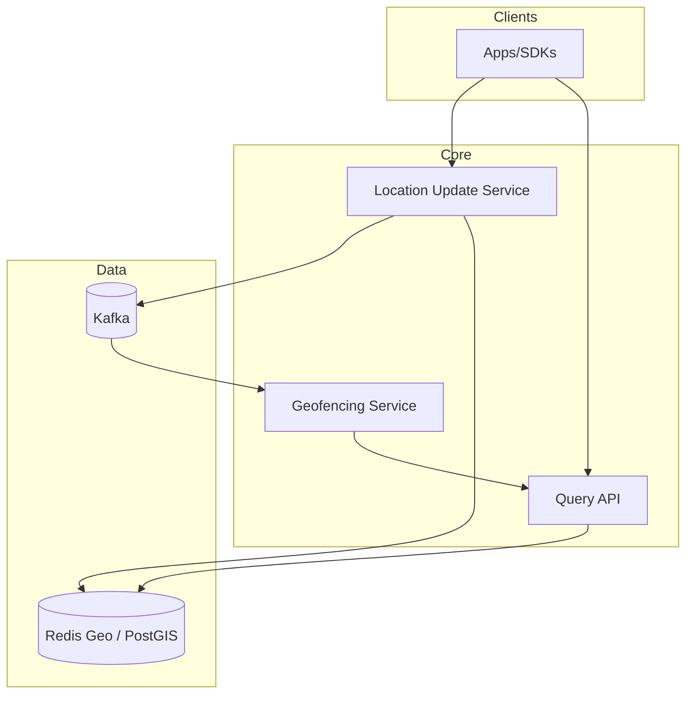

# 29-proximity-service - Proximity Service
Generated: 2025-11-02 20:38:46 -05:00

---

<!-- Source: 01-requirements.md -->
# Requirements & Scale

## Functional Requirements
1. **Radius Search**: Find places within N km of (lat, lon) → return list sorted by distance
2. **Real-Time Updates**: Track moving objects (Uber drivers) with location updates every 5s
3. **Polygon Search**: Find places within custom boundary (city limits, delivery zone)
4. **Filtering**: Filter by category (restaurants, gas stations), rating (>4 stars), open now
5. **Ranking**: Sort by distance, rating, popularity (click-through rate)
6. **Geofencing**: Trigger alerts when object enters/exits region (driver enters pickup zone)

## Non-Functional Requirements
**Latency**: p99 <100ms for radius queries (5km search)
**Throughput**: 1M queries/sec, 10M location updates/sec
**Accuracy**: <10m error for GPS coordinates
**Scalability**: 100M places, support global coverage (worldwide queries)

## Scale Estimates
**Places**: 100M static places (restaurants, stores)
**Moving Objects**: 10M active (Uber drivers, delivery bikes)
**Location Updates**: 10M objects × 1 update/5s = 2M updates/sec sustained, 10M peak
**Queries**: 1M queries/sec, 5km radius avg

**Infrastructure**:
- Geo Index (Redis with Geo commands): 100M places × 100 bytes = 10GB in-memory
- Location Update Service: 1000 nodes handling 10K updates/sec each
- Query Service: 500 nodes handling 2K queries/sec each

**Cost**: $300K/mo (compute) + $50K (Redis clusters) = **$350K/mo**


---

<!-- Source: 02-architecture.md -->
# 2) High-Level Architecture (Most Detailed)



## Components

### 1. Geospatial Index (Redis Geo / PostGIS)
**Redis Geo**: Stores places with lat/lon, supports GEORADIUS command (<10ms p99).
**PostGIS**: PostgreSQL extension for complex polygon queries (slower, 50ms p99).

**Data Model** (Redis):
```
GEOADD places -122.4194 37.7749 "restaurant:123"
GEORADIUS places -122.4194 37.7749 5 km WITHDIST
→ Returns: [(restaurant:123, 2.3km), (restaurant:456, 4.5km)]
```

### 2. Geohash / H3 Encoding
**Geohash**: Encode lat/lon into string (precision 6 = ~1km square).
```
(37.7749, -122.4194) → "9q8yy"
```
**H3**: Uber's hexagonal grid (more uniform than square grid).

**Benefits**: Prefix-based search (all places in "9q8yy*" are within 1km).

### 3. Location Update Service
Streaming service (Kafka + Flink) that:
1. Receives location updates (driver_id, lat, lon, timestamp)
2. Updates geospatial index (Redis GEOADD)
3. Computes Geohash → updates sharded index

### 4. Query Service (Radius Search)
API endpoint that:
1. Receives query (lat, lon, radius=5km)
2. Computes Geohash neighbors (9 cells for 5km search)
3. Queries Redis GEORADIUS for each cell
4. Merges results, sorts by distance
5. Returns top 20 places

### 5. Geofencing Service
Background job that:
1. Subscribes to location update stream
2. Checks if object entered/exited geofence (ST_Within polygon query)
3. Triggers webhook/push notification

## Data Flows

### Flow A: Radius Search
1. User → API: `GET /nearby?lat=37.77&lon=-122.41&radius=5km`
2. Query Service:
   - Compute Geohash: "9q8yy" (precision 5)
   - Get neighbors: ["9q8yy", "9q8yw", "9q8yv", ...] (9 cells)
3. Redis: `GEORADIUS places 37.77 -122.41 5 km WITHDIST`
4. Filter: category="restaurant", rating>4.0
5. Sort: By distance (ascending)
6. Return: Top 20 results with distance

**Latency**: 10ms Redis + 5ms filtering + 5ms sorting = **20ms total**.

### Flow B: Real-Time Location Update
1. Driver app → Location Update Service: `{"driver_id": 123, "lat": 37.78, "lon": -122.42}`
2. Service:
   - Compute Geohash: "9q8yz"
   - Redis: `GEOADD drivers 37.78 -122.42 driver:123`
   - Publish to Kafka: `driver_location_updates` topic
3. Geofencing Service (subscriber):
   - Check if driver entered pickup zone (polygon query)
   - If yes, trigger notification to rider

**Latency**: 5ms Redis update + 10ms Kafka publish = **15ms total**.

## API Design

**Radius Search**:
```http
GET /nearby?lat=37.77&lon=-122.41&radius=5km&category=restaurant&limit=20
→ [
  {"id": 123, "name": "Pizza Place", "distance": 2.3, "rating": 4.5},
  {"id": 456, "name": "Burger Joint", "distance": 4.1, "rating": 4.2}
]
```

**Update Location**:
```http
POST /location/update
{"object_id": "driver:123", "lat": 37.78, "lon": -122.42}
→ {"status": "ok", "geohash": "9q8yz"}
```

## Monitoring
- **Query Latency**: p50/p95/p99 for radius queries (target p99 <100ms)
- **Update Throughput**: Location updates/sec (target 10M peak)
- **Index Size**: # places indexed (track growth)
- **Geofence Triggers**: Alerts fired/sec (detect anomalies)


---

<!-- Source: 03-key-decisions.md -->
# Key Technical Decisions

## 1. Geohash vs. H3 (Hexagonal Grid)
**Decision**: **Geohash** for simplicity, **H3** for accuracy.
**Rationale**: Geohash is simpler (string-based, Redis native). H3 has uniform cell sizes (hexagons, no edge distortion).
**Reconsider**: For Uber-like use cases (driver matching), use H3 (Uber's open-source library).

## 2. Redis Geo vs. PostGIS (PostgreSQL)
**Decision**: **Redis Geo** for real-time queries, **PostGIS** for complex polygons.
**Rationale**: Redis is in-memory (<10ms queries). PostGIS supports advanced spatial queries (intersects, contains).
**Reconsider**: For complex queries (find places inside city limits + exclude parks), use PostGIS.

## 3. Precision: Geohash 6 (±1km) vs. Geohash 7 (±100m)
**Decision**: **Geohash 6** for city-scale search.
**Rationale**: 5km radius = ~5 Geohash 6 cells (manageable). Geohash 7 = ~50 cells (overhead).
**Reconsider**: For high-precision (delivery routing), use Geohash 7 or 8.

## 4. Sharding: By Geohash Prefix vs. Random
**Decision**: **By Geohash prefix** (first 2 chars).
**Rationale**: Co-locates nearby places on same shard → single-shard queries (no cross-shard joins).
**Reconsider**: For global load balancing (avoid hotspots), use random sharding.

## 5. Real-Time Updates: Push vs. Pull
**Decision**: **Push** (location update stream).
**Rationale**: Drivers push location every 5s → index always current. Pull (query on-demand) adds latency.
**Reconsider**: For battery-sensitive devices (low power), use pull (query when needed).

## 6. Caching: Per-Query vs. Per-Cell
**Decision**: **Per-cell caching** (Geohash prefix).
**Rationale**: Cache all places in "9q8yy" cell → reuse for nearby queries. Per-query cache has low hit rate.
**Reconsider**: For personalized queries (rating filters), use per-query cache.

## 7. Distance Calculation: Haversine vs. Euclidean
**Decision**: **Haversine** for accuracy.
**Rationale**: Haversine accounts for Earth curvature (accurate to 1m). Euclidean is 10% error at 100km distances.
**Reconsider**: For small distances (<1km), Euclidean is faster (accept 1% error).

## 8. Polygon Search: Pre-Filter vs. Post-Filter
**Decision**: **Pre-filter** with bounding box, **post-filter** with exact polygon.
**Rationale**: Bounding box is fast (Redis query). Exact polygon is slow (PostGIS). Pre-filter reduces candidates 10×.
**Reconsider**: For simple rectangles, bounding box only is sufficient (no post-filter).


---

<!-- Source: 04-wrap-up.md -->
# Wrap-Up & Deep Dives

## Scaling Playbook
**Stage 1 (MVP)**: PostgreSQL with PostGIS, 1M places, radius search with bounding box.
**Stage 2 (Production)**: Redis Geo, 10M places, Geohash indexing, real-time location updates (Kafka stream).
**Stage 3 (Scale)**: H3 hexagonal grid, 100M places, sharded by geohash prefix, geofencing with polygon queries, multi-region (geo-routing).

## Failure Scenarios
- **Redis Down**: Fall back to PostGIS (slower, 50ms vs. 10ms).
- **Location Update Lag**: Kafka backlog → stale driver locations (show last-known position).
- **Hotspot Shards**: Popular city (NYC) overloads shard → further partition (NYC = 10 sub-shards).

## SLO Commitments
- **Query Latency**: p99 <100ms for 5km radius search
- **Update Latency**: Location updates indexed within 100ms
- **Accuracy**: Distance error <10m (Haversine calculation)
- **Availability**: 99.9% uptime

## Common Pitfalls
1. **Euclidean Distance**: Use Haversine for Earth curvature (10% error at 100km).
2. **Single Shard Hotspot**: NYC queries overload one shard → partition by finer Geohash (6 → 7).
3. **No Geohash Neighbors**: Query only center cell → miss results on cell boundary (include 9 neighbors).
4. **Stale Locations**: Don't update driver location → show out-of-date position (confuses riders).
5. **No Geofencing**: Miss driver entering pickup zone → delayed notifications.

## Interview Talking Points
- **Geohash**: "Encode (37.77, -122.41) → '9q8yy' (precision 5 = ~1km square). Query prefix '9q8yy*' returns all nearby places."
- **Redis Geo**: "GEORADIUS places 37.77 -122.41 5 km WITHDIST → returns places sorted by distance in <10ms (in-memory)."
- **H3 vs. Geohash**: "H3 uses hexagons (uniform distances), Geohash uses squares (edge distortion). Uber uses H3 for driver matching."
- **Sharding**: "Shard by Geohash prefix (first 2 chars '9q') → co-locates nearby places on same shard (avoid cross-shard queries)."

## Follow-Up Questions
1. **Geofencing at Scale**: 1M active geofences × 10M drivers = 10T checks/sec. How to optimize?
2. **Moving Objects**: Track 10M drivers with 1 update/5s → 2M updates/sec. How to scale location update stream?
3. **Polygon Queries**: Complex delivery zones (exclude parks, lakes). How to optimize PostGIS queries?
4. **Multi-Region**: Global service (US, EU, Asia). How to partition data (geo-based vs. random)?
5. **Uber Driver Matching**: Match rider to nearest driver in <1s. How to prioritize by ETA, not just distance?

**Final Thought**: Proximity service trades **query latency** (use in-memory Redis) for **index update complexity** (real-time location streams). The key challenge is **sharding**—partition by geohash to co-locate nearby places, but avoid hotspots in dense cities (NYC, SF). Geofencing (polygon queries) requires PostGIS for accuracy, but pre-filter with bounding box to reduce load 10×.


