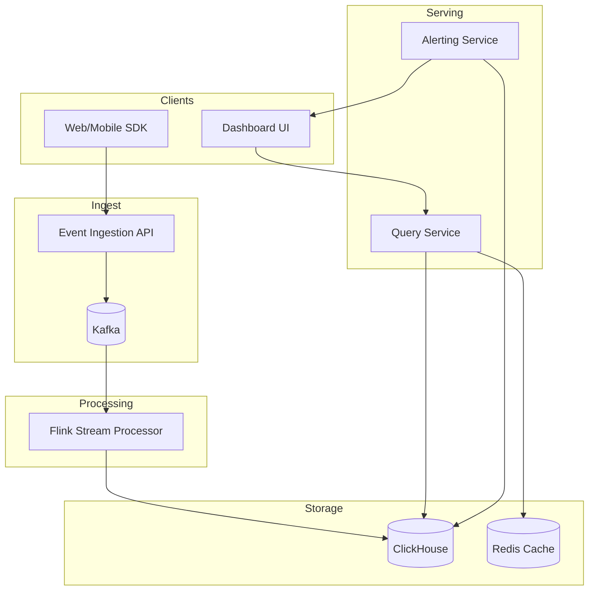

# 30-real-time-analytics-dashboard - Real Time Analytics Dashboard
Generated: 2025-11-02 20:38:46 -05:00

---

<!-- Source: 01-requirements.md -->
# Requirements & Scale

## Functional Requirements
1. **Event Ingestion**: Collect events (page views, clicks, purchases) via SDK/API
2. **Pre-Aggregation**: Compute rollups (page views per minute, revenue per hour) in real-time
3. **Dashboards**: Visualize time-series (line graphs), breakdowns (pie charts), tables
4. **Drill-Down**: Click metric → filter by dimensions (country, device, campaign)
5. **Custom Queries**: Ad-hoc SQL-like queries (GROUP BY, WHERE, ORDER BY)
6. **Alerts**: Notify when metric exceeds threshold (traffic drop >20%)
7. **Historical Analysis**: Query data from last 90 days (hot), 1 year (warm), 7 years (cold)

## Non-Functional Requirements
**Ingestion**: 100K events/sec sustained, 1M peak
**Freshness**: <1min lag (event ingestion → queryable)
**Query Latency**: p99 <3s for 7-day dashboard, <10s for 90-day historical
**Concurrency**: 10K concurrent dashboard users
**Cost**: <$0.001/event ingestion + storage + query

## Scale Estimates
**Events**: 10B events/day = 115K events/sec avg, 1M/sec peak
**Event Size**: 1KB avg (timestamp, user_id, page_url, country, device, ...)
**Raw Storage**: 10B × 1KB = 10TB/day raw events
**Pre-Aggregated**: 1000 metrics × 1440 min/day = 1.4M data points/day (100× compression)
**Query Load**: 10K users × 10 dashboard refreshes/min = 100K queries/min = 1.6K queries/sec

**Infrastructure**:
- Streaming: Kafka (100 brokers) + Flink (500 workers)
- OLAP DB: ClickHouse (200 nodes) for pre-aggregated data
- Cache: Redis for frequently accessed dashboards
- Raw Storage: S3 for archival (10TB/day × 90 days = 900TB)

**Cost**: $500K/mo (compute) + $100K (storage) + $50K (Kafka/Flink) = **$650K/mo**


---

<!-- Source: 02-architecture.md -->
# 2) High-Level Architecture (Most Detailed)



## Components

### 1. Event Ingestion API
REST/gRPC API receives events, batches them, publishes to Kafka.
```json
{"event": "page_view", "timestamp": "2024-01-01T12:00:00Z", "user_id": 123, "page": "/product", "country": "US", "device": "mobile"}
```

### 2. Kafka (Event Stream)
Distributed log storing raw events (7-day retention), partitioned by user_id for ordering.

### 3. Stream Processor (Flink)
Real-time aggregation:
- **Tumbling Windows**: Page views per minute (rollup every 60s)
- **Session Windows**: User sessions (group events with <30min gaps)
- **Stateful Joins**: Enrich events (user_id → user_country from user profile DB)

### 4. OLAP Database (ClickHouse)
Columnar DB storing pre-aggregated data:
```sql
CREATE TABLE metrics (
  timestamp DateTime,
  metric_name String,
  value Float64,
  dimensions Map(String, String)  -- {country: US, device: mobile}
) ENGINE = MergeTree()
PARTITION BY toYYYYMMDD(timestamp)
ORDER BY (metric_name, timestamp);
```

**Query Example**:
```sql
SELECT timestamp, sum(value) AS total_views
FROM metrics
WHERE metric_name = 'page_views'
  AND timestamp >= now() - INTERVAL 7 DAY
  AND dimensions['country'] = 'US'
GROUP BY toStartOfHour(timestamp)
ORDER BY timestamp;
```

### 5. Query Service
API layer that:
1. Receives dashboard query (metric, time range, filters)
2. Checks cache (Redis): `dashboard:page_views:7d:US` → cache hit (90% hit rate)
3. If miss, queries ClickHouse → caches result (TTL 1min)
4. Returns aggregated data (time-series array)

### 6. Dashboard UI (React + Grafana)
Web UI rendering charts:
- **Time-Series**: Line graphs (page views over time)
- **Breakdowns**: Pie charts (traffic by country)
- **Tables**: Top pages by views

### 7. Alerting Service
Background job that:
- Evaluates alert rules every 1min (PromQL-style queries)
- Detects anomalies (traffic drop >20% vs. last hour)
- Sends notifications (Slack, PagerDuty)

## Data Flows

### Flow A: Event Ingestion → Pre-Aggregation
1. User → SDK: Page view event
2. SDK → Ingestion API: Batch 100 events
3. API → Kafka: Publish to `events` topic
4. Flink (consumer):
   - Read events from Kafka
   - Tumbling window (60s): Aggregate page views per country per device
   - Output: `{timestamp: "2024-01-01T12:01:00Z", metric: "page_views", country: "US", device: "mobile", value: 1500}`
5. Flink → ClickHouse: Batch insert (1000 rows)

**Latency**: 10s event batch + 60s window + 10s insert = **80s lag** (within 1min SLA).

### Flow B: Dashboard Query
1. User → Dashboard UI: Load "Page Views (7d)" dashboard
2. UI → Query Service: `GET /metrics?name=page_views&range=7d&country=US`
3. Query Service → Redis: `GET dashboard:page_views:7d:US` → cache miss
4. Query Service → ClickHouse:
```sql
SELECT toStartOfHour(timestamp) AS hour, sum(value)
FROM metrics
WHERE metric_name = 'page_views' AND country = 'US' AND timestamp >= now() - 7
GROUP BY hour;
```
5. ClickHouse → Query Service: 168 rows (7 days × 24 hours)
6. Query Service → Redis: `SET dashboard:page_views:7d:US <result> EX 60`
7. Query Service → UI: JSON response
8. UI renders line graph

**Latency**: 20ms cache lookup + 2s ClickHouse query + 500ms rendering = **2.5s total**.

### Flow C: Drill-Down (Filter by Device)
1. User clicks "Mobile" on pie chart
2. UI → Query Service: `GET /metrics?name=page_views&range=7d&country=US&device=mobile`
3. Query Service → ClickHouse (cache miss for new filter):
```sql
... WHERE country = 'US' AND device = 'mobile' ...
```
4. Return filtered results (50% of original data)

## API Design

**Send Events**:
```http
POST /events
[
  {"event": "page_view", "user_id": 123, "page": "/home", ...},
  {"event": "click", "user_id": 123, "element": "button", ...}
]
→ {"status": "accepted", "count": 2}
```

**Query Metrics**:
```http
GET /metrics?name=page_views&range=7d&group_by=country&filter=device:mobile
→ [
  {"country": "US", "value": 1500000},
  {"country": "UK", "value": 500000}
]
```

## Monitoring
- **Ingestion Rate**: Events/sec (track spikes, capacity planning)
- **Lag**: Time from event generation → queryable (target <1min)
- **Query Latency**: p50/p95/p99 (target p99 <3s)
- **Cache Hit Rate**: % queries served from cache (target >90%)
- **ClickHouse Storage**: Disk usage (partition pruning, compression)


---

<!-- Source: 03-key-decisions.md -->
# Key Technical Decisions

## 1. Pre-Aggregation vs. Raw Event Queries
**Decision**: **Pre-aggregation** (1-min rollups) for dashboards.
**Rationale**: Querying 10B raw events = 10s+ latency. Pre-aggregated = 1.4M rows = <3s latency. 100× data reduction.
**Reconsider**: For drill-down queries (rare dimensions), query raw events (accept 10s latency).

## 2. ClickHouse vs. Druid vs. Elasticsearch
**Decision**: **ClickHouse** for cost/performance.
**Rationale**: ClickHouse is fastest (columnar, vectorized queries), cheapest (open-source). Druid is complex. Elasticsearch is slow for aggregations.
**Reconsider**: For full-text search (logs), use Elasticsearch. For real-time ingestion (<1s lag), use Druid.

## 3. Stream Processing: Flink vs. Spark Streaming
**Decision**: **Flink** for true real-time (<1min lag).
**Rationale**: Flink has event-time processing (correct results with out-of-order events). Spark Streaming is micro-batches (2-5min lag).
**Reconsider**: For batch processing (hourly jobs), use Spark (simpler).

## 4. Caching: Per-Dashboard vs. Per-Query
**Decision**: **Per-dashboard caching** (1-min TTL).
**Rationale**: Dashboards are frequently accessed (90% cache hit). Per-query cache has low hit rate (infinite combinations).
**Reconsider**: For personalized dashboards (user-specific filters), use per-query cache.

## 5. Data Retention: Hot/Warm/Cold Tiering
**Decision**: **Hot (7d SSD), Warm (90d HDD), Cold (1y S3)**.
**Rationale**: 80% queries are last 7 days (hot). Warm/cold are rarely accessed (accept 10s latency).
**Reconsider**: For compliance (7-year retention), keep all data in cold storage (S3 Glacier).

## 6. Alerting: Threshold-Based vs. Anomaly Detection
**Decision**: **Threshold-based** (traffic drop >20%) with optional ML anomaly detection.
**Rationale**: Thresholds are simple, predictable. ML detects novel anomalies but has false positives.
**Reconsider**: For complex metrics (seasonality, trends), use ML anomaly detection.

## 7. Sampling: None vs. 1% for High-Volume Events
**Decision**: **Sampling for debug events** (1%), no sampling for business metrics (page views).
**Rationale**: Debug events (mouse moves) = 10× volume, low value. Business metrics must be accurate.
**Reconsider**: For cost reduction, sample all events (accept accuracy loss).

## 8. Query Timeout: 30s vs. No Limit
**Decision**: **30s timeout** for dashboard queries.
**Rationale**: Prevents expensive queries from consuming resources. Users expect <3s (30s is fallback).
**Reconsider**: For data science queries (complex ad-hoc), allow longer timeouts (5min).


---

<!-- Source: 04-wrap-up.md -->
# Wrap-Up & Deep Dives

## Scaling Playbook
**Stage 1 (MVP)**: PostgreSQL, 1M events/day, hourly batch aggregation (Spark), 10s query latency.
**Stage 2 (Production)**: ClickHouse, 100M events/day, 1-min Flink streaming, 3s query latency, Redis cache.
**Stage 3 (Scale)**: 10B events/day, 500-node ClickHouse cluster, hot/warm/cold tiering, 90% cache hit rate, ML anomaly detection, multi-region.

## Failure Scenarios
- **Kafka Lag**: Flink falls behind → dashboard data is stale (5min lag instead of 1min). Auto-scale Flink workers.
- **ClickHouse Overload**: Too many concurrent queries → query timeout. Rate-limit queries, increase cache TTL.
- **Cache Stampede**: Dashboard cache expires, 1000 users query simultaneously → ClickHouse overload. Stagger cache expiration (jitter).

## SLO Commitments
- **Data Freshness**: <1min lag (p95) from event → queryable
- **Query Latency**: p99 <3s for 7-day dashboard, <10s for 90-day
- **Availability**: 99.9% uptime for dashboard service
- **Accuracy**: 99.9% of events ingested (0.1% acceptable loss for non-critical events)

## Common Pitfalls
1. **No Pre-Aggregation**: Querying raw events (10B rows) = 10s+ latency. Pre-aggregate to 1.4M rows (100× reduction).
2. **Hot Partitions**: Partition Kafka by user_id → popular users overload partition. Use round-robin or hash(user_id % 1000).
3. **Cache Stampede**: Dashboard cache expires → 1000 queries hit ClickHouse. Stagger expiration (TTL 60s ± 10s).
4. **No Query Timeout**: Expensive query scans 90 days × 10B events → crashes ClickHouse. Enforce 30s timeout.
5. **Ignoring Out-of-Order Events**: Mobile events arrive late (offline mode) → wrong aggregates. Use Flink event-time processing.

## Interview Talking Points
- **Pre-Aggregation**: "10B raw events → 1.4M pre-aggregated rows (1-min rollups) → 100× data reduction → <3s query latency."
- **ClickHouse**: "Columnar DB optimized for OLAP (aggregations) → 10× faster than PostgreSQL for analytics queries."
- **Flink Streaming**: "Tumbling windows (60s) → aggregate page views per country per device → <1min lag (event → queryable)."
- **Caching**: "Redis caches dashboards (1-min TTL) → 90% cache hit rate → reduces ClickHouse load 10×."

## Follow-Up Questions
1. **Cardinality Explosion**: User_id in dimensions (1B users) → 1B rows per metric. How to handle?
2. **Real-Time Joins**: Enrich events with user profile (user_id → country). How to minimize latency?
3. **Data Freshness vs. Cost**: <1min lag requires expensive streaming. When to use 5-min or hourly batches?
4. **Multi-Tenancy**: Isolate dashboards per customer (SaaS). How to prevent cross-tenant queries?
5. **Approximate Queries**: Use HyperLogLog for distinct counts (1% error, 10× memory savings). When to use?

**Final Thought**: Real-time analytics balances **freshness** (<1min lag via streaming) with **cost** (pre-aggregation reduces storage/query cost 100×). The key trade-off is **granularity**—store 1-min rollups for dashboards (cheap, fast), keep raw events for drill-downs (expensive, slow). ClickHouse's columnar storage + Flink's event-time processing + Redis caching = <3s dashboards at $0.001/event.


